---
# Methods
---

## 1. Protein Crystal Preparation

### 1.1. Available structures

There are 4 pdb structures that are deposited to protein data bank as the result of the [Rama's Nature paper](https://www.nature.com/articles/nature20571)

 - 5e11 (obtained at 289K with no E field - two alternative conformations A and B)
 - 5e22 (obtained at 289K with E field - two alternative conformations A and B as well as two assymetric units)
 - 5e21 (obtained at 277K with no E field - one single conformation)
 - 5e1y (obtained at 277K with no E field - three alternative conformations A, B and C (for only one residue))

> Note: Laue crystallography is the process when a stationary crystal is illuminated by a polychromatic X-Ray beam.
> Conventional crystallography is when the moving crystal is illuminated by a monochromatic beam of X-Rays.

Two structures at 277 K where obtained at the other facility (at the Stanford Synchrotron Radiation Lightsource (SSRL, 11-1) using the PILATUS 6M PAD detector from a single crystal and indexed, integrated, scaled and merged in HKL2000). They were used as a reference to refine structures during EFX experiment, which are obtained at 289K (15C) with Laue crystallography.

### 1.2. Isolation of alternate conformations

When analysing structural differences between all four pdbs, it's important to isolate alternative conformations, such as A and B. Overall, we extracted 9 structures (index A, B or s indicate conformation A, B or single, respectively; E1, E2 or noE indicate the presence or absence of electric field and its direction):

- `277_noE_A`
- `277_noE_B`
- `277_noE_s`
- `289_noE_A`
- `289_noE_B`
- `289_E1_A`
- `289_E1_B`
- `289_E2_A`
- `289_E2_B`

### 1.3. Analysis of structural differences

The RMSD analysis was performed in the jupyter notebook file [rmsd_analysis.ipynb](rmsd_analysis.ipynb). Here I look at the pairwise rmsd (in Å) between all nine structures taking into account common heavy atoms' positions. (All pdbs have different atom numbers and I had to find the set of common atoms)

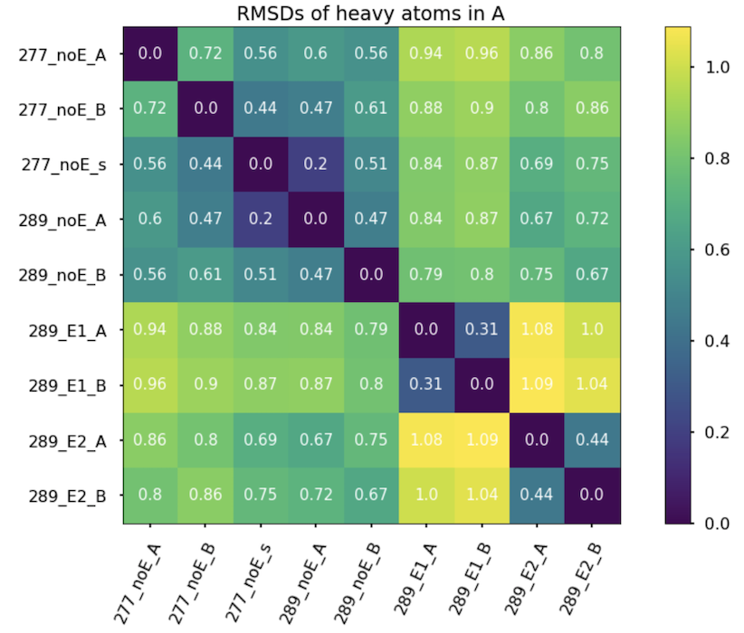

As expected, the biggest difference is between the conformation of two opposite electric field directions (1.1 Å). Although, we expected much bigger difference. 

### 1.4. Choice of the structure for the simulation - `289_noE_A`

Further we decided to choose the structure collected in the absence of E-field at room temperature (289 K) and use only alternate conformation A (it has higher occupancy 0.7 vs 0.3 of B); so we pick `289_noE_A` as initial structure for our modelling. We assume that equilibration steps will eliminate any diffrence between A and B.

> Need to check it after we're done with the setup.

### 1.5. Design of the crystal

For the simulation of the crystal environment (in the presence and absence of E-field) we decided to use 3 systems: 

| One subunit of PDZ domain in water (Lauren's) [**1SU**]  |  The full 4-subunits crystal cell [**1UC**] | 3x3x3 grid of 4-subunits crystal cells [**27UC**] |
:-------------------------:|:-------------------------:|:-------------------------: 
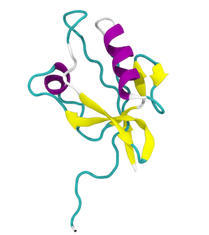 | 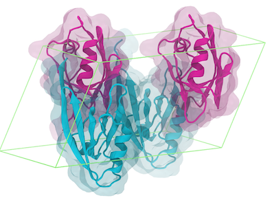 | 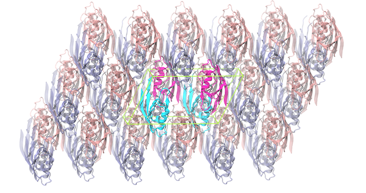 
:-------------------------:|:-------------------------:|:-------------------------: 

We need to analyze structural differences between all three models. The fixed protein in water (**1SU**) is unlikely to behave as the protein in an actual crystal since there are no crystal packing forces and flexible termini can move substantially due to the thermal fluctuations. We want to compare this behavior with more natural representation of the crystal - the system with the same box dimensions as crystal's unit cell (**1UC**) + periodic boundary conditions. This will presumably mimic the protein crystal environment. However, the proteins in the unit cell will see their periodic image, which should be avoided. Thus, 3x3x3 unit cells system (**27UC**) is an attempt to describe a protein crystal in a way where the central unit cell doesn't see its periodic image and hence dynamics is considered 'unperturbed'. 

- Single PDZ subunit (**1SU**) is extracted from a pdb file (`289_noE_A`) in a text editor. 

- In the PDB there are missing atoms:

> REMARK 470 MISSING ATOM                                                         
> REMARK 470 THE FOLLOWING RESIDUES HAVE MISSING ATOMS (M=MODEL NUMBER;           
> REMARK 470 RES=RESIDUE NAME; C=CHAIN IDENTIFIER; SSEQ=SEQUENCE NUMBER;          
> REMARK 470 I=INSERTION CODE):                                                   
> REMARK 470   M RES CSSEQI  ATOMS                                                
> REMARK 470     LYS A 396    CE   NZ                                             
> REMARK 470     GLU A 401    CD   OE1  OE2 

These atoms should be included in the structure first, [charm-gui](http://www.charmm-gui.org/) web-server is used fot this purpose.

- The construction of one unit cell (**1UC**) is done using [charm-gui](http://www.charmm-gui.org/) web-server as well. It allows to reconstruct the whole crystal cell from the pdb file and the symmetry group provided in the file: all rotations and translations are applied automatically. The symmetry group for the `289_noE_A` structure in 5e11 is `C 1 2 1`.

- The supercell system (**27UC**) is then constructed in the [uc_builder.ipynb](uc_builder.ipynb) script, by extending `a, b, c` crystallographic axes 3 times and conserving `alpha, beta, gamma` angles in the the full 4-subunits crystal cell file.  

> NB: VMD will not represent secondary structures for the pdb files that contain more than 77,000 atoms. Examples are these: [VMD-no-ss](charmm-gui/78000_at_noss.pdb) and [VMD-ss](charmm-gui/76000_at_ss.pdb). Using different visualizers (NGLView, PyMOL, Chimera) can solve the problem.

### 1.6. Importance of pdb hydrogens

Citation from Lauren's email: 

> By the way, I'm told that the hydrogens in the pdb are known as "riding hydrogens" - it's standard practice in crystallography to include them, as we "kind of know where they should be" and they explain some aspects of the electron density. And they are not entirely invisible to X-ray crystallography. (These are essentially direct quotes from Doeke, first author of the 2016 paper.) 
I think it's ok to ignore the riding hydrogens in the PDB and use the hydrogens which are automatically added in the simulation preparation since we minimize the structure before simulating anyway.

### 1.7. Importance of using crystal waters

Lauren and Mike Socolich, a research scientist in their lab who has done a lot with EFX, suggested to use the positions of crystal waters (i.e those oxygens resoved in the X-Ray crystallography and contained in pdb files) when building the crystal models. We assumed that their importance will be evident from the simulations and conducted a quantitative test where we looked at the positions occupied by crystal oxygens in the original pdb over the equlibrium simulation. Analysis of occupancy of these cites over the course of simulations is performed in [`crystal_water.ipynb`](crystal_water.ipynb) file for **1UC** system. 

**Algorithm description:** Firstly, we save the inital coordinates of crystal oxygens. Secondly, at every time step we align current protein structure to the initial one and use these translation vector and rotational matrix to compute the positions of crystal water sites. Thirdly, we go through all bulk water oxygens and estimate how many of them are within the cutoff distance to the crystal waters' oxygen sites. This yields a percent of occupied crystal sites out of possible 376 for a specific cutoff distance and time frame. The same procedure can be used to analyse how often any random bulk water sites (from initial gro file) are occupied at each time step. Lastly, we can compare how more often crystal water sites are occupied in comparison to random water sites averaged over time. More details are in comment section of [`crystal_water.ipynb`](crystal_water.ipynb) file.

**Main results:**

- Occupancy of the crystal water sites vs random water sites (using alignment to initial structure and recomputing of the water coordinates, see the jupyter notebook comments) for a specific cutoff distance [1.0 Å]:

| Occupancy for each time step for each water site  - cutoff 1.0 Å |  Occupancy for each time step - cutoff 1.0 Å|
:-------------------------:|:-------------------------:
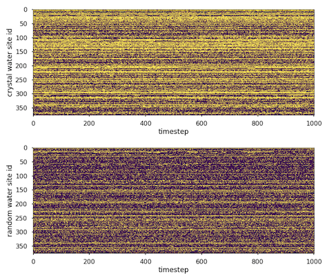 | 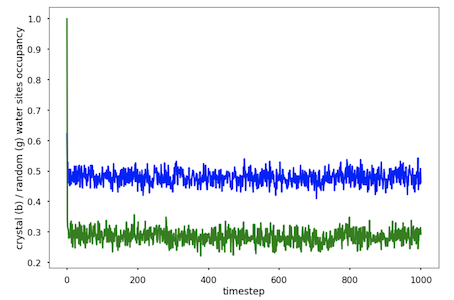 

- Occupancy of the crystal water sites vs random water sites averaged over time for a range of cutoff distances:

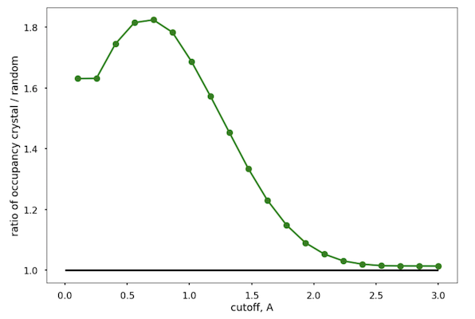  

Intuitively, the last graph represents something like "a radial distribution function" for the crystal waters. This non-monotoneous function converging to unity shows that at the distances less than 2.0 Å from the crystal sites, it is more likely to find a water than from the bulk water sites. It means these sites serve as "magnets" - crystal water postions are more favorable in a crystal during simulation. Thus, the setup of the crystal cell seems to reproduce this effect.

### 1.8. Salt concentration and pH

**Lines from the `5e11.pdb` file:**

> CRYSTAL SOLVENT CONTENT, VS   (%): 43.07                                     
> MATTHEWS COEFFICIENT, VM (ANGSTROMS^3/DA): 2.16                     
> CRYSTALLIZATION CONDITIONS: 27-31% PEG 300, 48 MM CITRIC ACID, 35 MM NAH2PO4, PH 4.5, VAPOR DIFFUSION, HANGING DROP, TEMPERATURE 293K 

Based on the content of the crystallization buffer, we assume that the solid protein crystal has a very similar pH and salt concentration as an actual buffer solution. We also model 35 MM NAH2PO4 as simple sodium chloride NACL with 0.035 M concentration. 

- We ignore PEG and a weak citric acid as well and don't model it in a system.

- Analyzing the solvent content of the crystal, 43% by volume, we can estimate the number of water molecules needed to be added to the crystal cell (V = 89.106 nm^3): 1282 water molecules, including 94 x 4 = 376 crystal waters. 

- PH 4.5 in the crystal will affect protonation states of charged side chains, such as Histidine, Aspartic and Glutamic acids. See titration curves below:

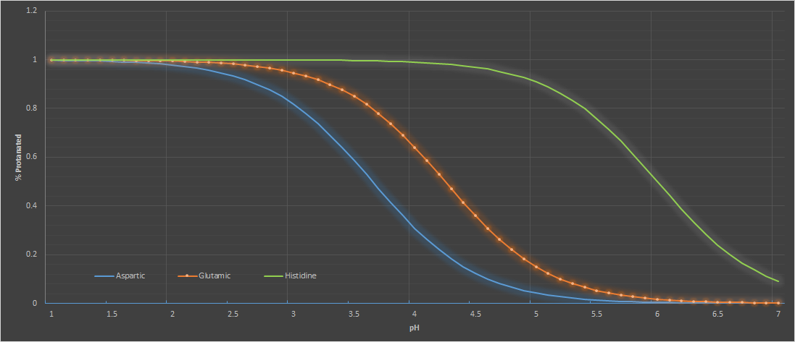

- At pH 4.5, glutamic acid is about 40% protonated. Physically, percent of protonation means how much time on average these functional groups have hydrogen on them vs lose the proton and have a negative net charge. This time dependence is impossible to model with conventional MD, where charges are constant. Modeling of protonation can in principle be done using statistical approach, e.g. by running 100 simulations in total with 40 of them having a hydrogen and 60 - not having the hydrogen; and this is only for one charged side chain. If you have a number of them, statistical approach is not feasible. Thus, in MD, proper protonation modeling is available either for 100% or 0% protonation state. 

- For pH 5, Histidine is mostly (95%) protonated, whereas Aspartic and Glutamic acids are mostly (5% and 15%, respectively) deprotonated. The value of pH 5 is a good approximation for fully protonated Histidine, and fully deprotonated Aspartic and Glutamic acids. 

### 1.9. Compressibility of the protein crystal

When running MD simulations in NPT ensemble, the value of the compressibility of the system needs to be specified. Compressibility is a measure of the relative volume change of a fluid or solid as a response to a pressure change. Since we are modeling an actual rigid crystal we assume that its compressibility is higher than the one for a protein in water. A brief literature search suggests that for protein crystals the experimentally measured values of compressibility are about `20E-6 bar^-1`. [Source](http://citeseerx.ist.psu.edu/viewdoc/download?doi=10.1.1.726.4812&rep=rep1&type=pdf) which is twice as lower than the one for water (`45E-6 bar^-1`).

### 1.10. Unit cell volume change in NPT ensemble

The general prodcedure of how to construct a proper crystal system for MD simulation is described [here](https://onlinelibrary.wiley.com/doi/full/10.1002/wcms.1402). 

In short:
When solvating a protein in a crystal cell, the right amount of water have to be added in order to keep crystal simulations at the correct volume. This step is crucially important since the unit cell axes (hence, the volume) should be relatively constant across the whole protein crystall in order to provide a resolvable diffraction pattern. 

While equilibrating a system in NVT emsemble, the volume is kept constant by definition. However, if you switch to the NPT ensemble (which EFX experiment is), the volume of the box can change substantially in order to keep required water density (and pressure) constant. For instance, if the amount of solvent molecules is not sufficient, vacuum voids may form at the NVT step, which will potentially affect the dynamics of the protein. NPT procedure will of course remove the bubbles by adjusting the volume of the unit cell. Nevetherless, we have to avoid large volume fluctuations by choosing the precise amount of water.

> As mentioned before, we can estimate the total number of water molecules needed to be added to the crystal cell (43% of solvent content for V = 89.106 nm^3): 1282 water molecules, including 94 x 4 = 376 crystal waters.

- __TOOLS__: Niagara Supercomputer / GROMACS 2019.1 / MDAnalysis module for Python

- __Force Field__: CHARMM36m with TIP3P water model

__Description of the procedure:__ 

1. Solvate the system using standard GROMACS protocol `gmx solvate`: a pre-equilibrated box of TIP3P solvent is tiled into the crystal cell box. The water molecules that clash with the protein are removed from the system. The number of solvent molecules added for **1UC** - 795; for **27UC** - 21794; 

2. Add a number water molecules through `gmx insert-molecules` and modify the topology of the system accordingly. Range 75 to 99 (increment of 4) - for **1UC**. And the range from 2030 to 2200 for **27UC**.

3. Run position restraint (2 ns), NVT (10 ns) and NPT Berendsen (10 ns), and NPT Parinello-Rahman Anisotropic (100 ns) equilibration for each number of extra added water molecules. 

> Note: the simulations of **1UC** crashed when using anisotropic PR algorithm, after the simulation box flattened in one of the directions. The problem is believed to be caused by the interactions with the periodic image. In order to avoid crashing we switched to the isotropic pressure coupling algorithm. It helped, however this algorithm couldn't equilibrate the pressure in the **27UC** system when all-bond constraints with 4fs time step were used. As a result of trial-and-error search, we decided to: 
- exclude **1UC** system from out project (reason: interaction with periodic image)
- not to use isotropic pressure coupling for any crystal simulations (reason: crystal is a rigid system with high protein content and is anisotropic by nature)
- use isotropic pressure coupling algorithm for a protein in water **1SU** (reason: 90% of the system is water, which is a isotropic system by nature)
- not to use virtual sites for hygrogens, thus compute with 2fs time step and h-bonds constraints (reason: it creates difficulties with pressure coupling algorithms)

4. Do analysis of the volume changes and find the optimal number of water molecules to add that minimize volume fluctuations and keep the volume as close as posssible to a real unit cell volume: V = 2405.8 nm^3 for **27UC**.

| Relative deviation from the true volume for a range of water added |  Volume fluctuations for N = 87 H2O molecules|
:-------------------------:|:-------------------------:
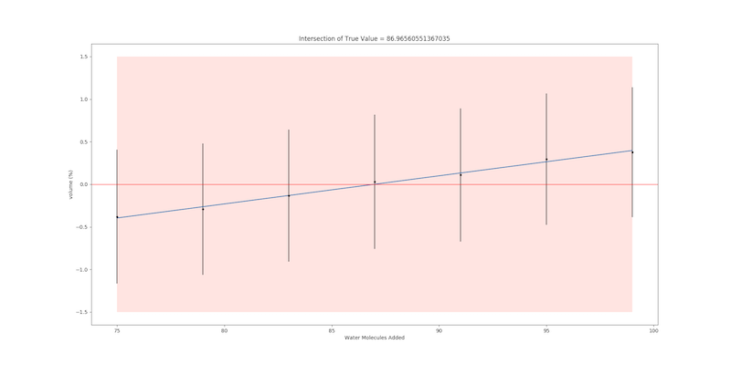 | 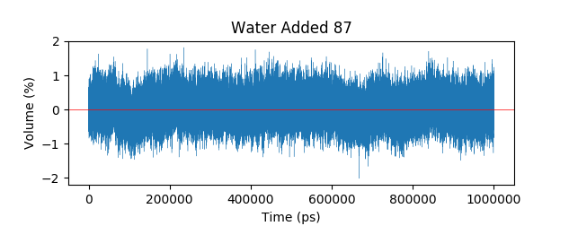 

The system with the correct amount of solvent remains mostly within 1.0% of the correct unit cell volume for the rest of the simulation. The black vertical line shows a 95% confindence interval, i.e. 95% of the time the system's volume fluctuates within these limits. Thus, the optimal number of water molecules for the **1UC** is N = 87. For **27UC** N = ???. 

## 2. Test simulations with electric field

### 2.1. Heating of the crystal in NVE ensemble

We ran the test simulation of **1UC** system with electric field ON in the NVE ensemble, where the system is not coupled to any heat or pressure bath. Thus, the energy inflow from the external electric field makes the charges move faster, which leads to the very abrupt temperature increase (in 10 ns). The graph shows the temperature vs time for NVE simulation:

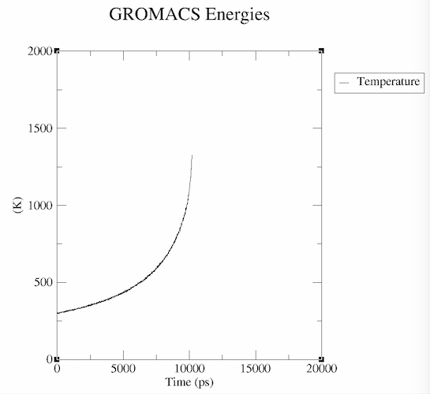

The results demonstrate that the temperature change during the experiment cannot be ignored. Since the experiment is done at 289K we will simulate the system coupled to a heat bath with T = 300K, which is reasonable assumptions. 

> There are attempts to measure the temperature of the crystal experimentally...Ongoning work

### 2.2. Stress test of the crystal in electric field

We also ran a set of production simulations with varying E-field (from 1 to 10 MV/cm) to see how well the crystal can withstand high electric fields. 

